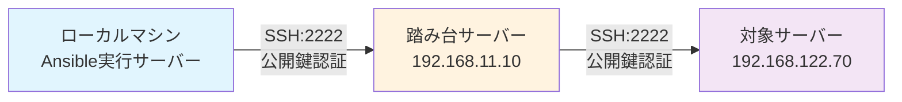

# example-ansible-proxyjump

## 構成


## Usage

### 疎通テスト
```
ansible -i hosts ansible-client -m ping
```

### 実行
```
ansible-playbook -i hosts pb-test_role.yml -vvv
```

## Note
対象サーバーをパスワードで認証する場合、`sshpass`のインストールが必要。

```
sudo apt install -y sshpass
```
